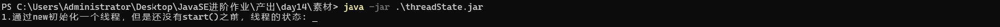
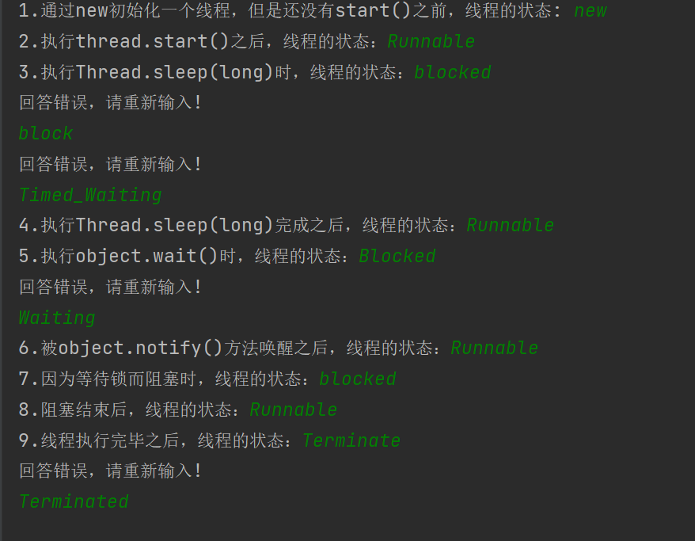
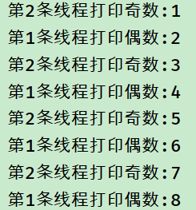
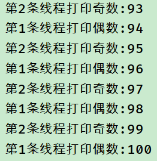
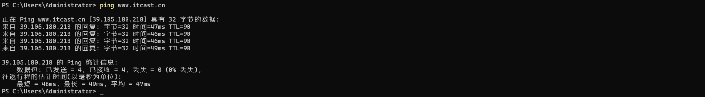
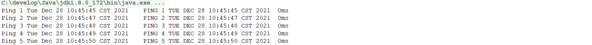

# 1 简答题

## 1.1 简答题一

在素材的文件夹中给大家提供了一个可运行的程序包(threadState.jar),请运行该java包，如下图所示：

|  |
| ------------------------------------------------------------ |

输入正确的线程状态使程序可以正常执行完毕！请依次说明线程对应的状态。



## 1.2 简答题二

简述通过ThreadPoolExecutor创建线程池时，构造方法对应的7个参数分别表示什么意思？并说明常见的任务的拒绝策略都有哪些？

```
 通过ThreadPoolExecutor创建线程池时，构造方法对应的7个参数分别表示：

corePoolSize：核心线程池大小，即线程池中保留的线程数，即使它们处于空闲状态也会被保留。
maximumPoolSize：线程池最大线程数，包括核心线程数和非核心线程数。
keepAliveTime：线程空闲后的存活时间，当线程池中线程数超过corePoolSize时，如果有空闲线程，超过空闲时间后将被回收，以维护线程池的数量。
unit：keepAliveTime的时间单位，TimeUnit枚举类型。
workQueue：任务队列，用于保存等待执行的任务，有多种实现方式。
threadFactory：线程工厂，用于创建线程，可自定义线程的名称、优先级等。
handler：任务拒绝策略，当任务队列已满且线程池中的线程数达到最大线程数时，采取的策略。
常见的任务的拒绝策略有以下四种：

AbortPolicy：直接抛出异常，阻止系统正常运行。
CallerRunsPolicy：只用调用者所在的线程来执行任务。
DiscardOldestPolicy：丢弃任务队列中最早等待执行的任务，并尝试再次提交当前任务。
DiscardPolicy：直接丢弃任务，不予任何处理。
```

## 1.3 简答题三

简述线程池的工作流程？

```
线程池是一种管理线程的机制，它可以重复使用已创建的线程，从而减少线程创建和销毁造成的开销。线程池的工作流程如下：

程序创建一个线程池，并设置线程池的基本参数，如核心线程数、最大线程数、任务队列等。
当有任务需要执行时，程序首先判断核心线程池是否已满，如果未满，则创建一个新的线程来执行任务，否则将任务加入任务队列等待执行。
当任务队列已满且线程池中的线程数达到最大线程数时，采取任务拒绝策略，如抛出异常、丢弃任务、阻塞等待等。
当线程执行完一个任务后，它并不会被销毁，而是继续等待执行下一个任务，直到达到线程空闲时间的上限，这个时间由keepAliveTime参数指定，超过这个时间后，线程将被回收，以维护线程池的数量。
程序可以通过ThreadPoolExecutor提供的方法来动态地修改线程池的参数，如增加或减少线程池的大小、修改任务队列等。
总的来说，线程池主要作用是降低线程的创建和销毁开销，提高程序的性能和稳定性。同时，线程池还可以有效地控制线程的并发数量，避免系统资源的过度占用和线程间的竞争问题。
```

## 1.4 简答题四

简述网络编程三要素以及它们的含义？

```
网络编程三要素是：IP地址、端口号、协议。

IP地址：IP地址是Internet协议中用于唯一标识网络中设备的地址，它是由32位二进制数表示的，通常以点分十进制的形式呈现。在网络通信中，IP地址用于标识发送和接收数据的设备，是网络通信的基础。

端口号：端口号是一个16位的数字，它用于标识一个应用程序或服务在网络上的唯一标识，范围是0~65535。在网络通信中，端口号与IP地址组合，用于标识一个具体的网络连接，确保数据的正确传输。

协议：协议是网络通信中的一种规范或约定，它规定了数据传输的格式、内容、顺序、错误处理等内容。常见的网络协议有TCP、UDP、HTTP、FTP等。不同的协议适用于不同的场景，例如TCP协议适用于可靠的数据传输，而UDP协议适用于实时数据传输。

综上所述，IP地址、端口号和协议是网络编程中的三个基本要素，是保证网络通信正常和有效的基础。

```

## 1.5 简答题五

简述ipv4和ipv6的组成规则？

```shell
IPv4和IPv6都是互联网协议(IP)的版本，它们的组成规则略有不同：

IPv4：IPv4地址由32位二进制数组成，通常表示为4个十进制数，每个数之间用点号分隔。例如：192.168.0.1。IPv4地址分为网络部分和主机部分，网络部分用于标识网络，主机部分用于标识主机。IPv4还支持子网掩码，用于将IP地址划分成不同的子网。

IPv6：IPv6地址由128位二进制数组成，通常表示为8个16进制数，每个数之间用冒号分隔。例如：2001:0DB8:0000:0000:0000:8A2E:0370:7334。IPv6地址分为网络前缀和接口标识，网络前缀用于标识网络，接口标识用于标识主机。IPv6还支持多个前缀的地址，用于实现多个网络的互联。

总的来说，IPv4和IPv6都是用于标识网络设备的地址，但IPv6采用了更长的地址格式，支持更多的地址空间和更多的网络拓扑结构。IPv6还增加了一些新的特性，如流标签、移动IPv6等，可以更好地满足未来互联网的需求。
```

## 1.6 简答题六

简述UDP协议和TCP协议的特点？

```shell
UDP协议和TCP协议都是互联网传输层的协议，它们的特点如下：

UDP协议的特点：

无连接：UDP协议是无连接的，即发送数据之前不需要建立连接，也不需要维护连接状态，因此UDP协议具有较小的开销和较快的传输速度。

不可靠：UDP协议是不可靠的，它不保证数据的可靠传输，可能会存在丢包、重复、乱序等问题。

面向报文：UDP协议是面向报文的，每个UDP数据报都是一个独立的报文，应用程序需要自己处理数据的完整性和可靠性。

支持广播和多播：UDP协议支持广播和多播，可以向多个主机发送数据。

TCP协议的特点：

面向连接：TCP协议是面向连接的，必须先建立连接才能进行数据传输，建立连接需要进行三次握手，维护连接状态需要消耗较多的资源。

可靠传输：TCP协议是可靠的，它保证数据的可靠传输，可以检测丢包、重传、乱序等问题，确保数据的正确性和完整性。

面向流：TCP协议是面向流的，数据是以流的形式进行传输，应用程序需要自己处理数据的边界和分割。

支持点对点通信：TCP协议支持点对点通信，即一对一的通信方式。

综上所述，UDP协议适用于实时传输、广播、多播等场景，而TCP协议适用于可靠传输、点对点通信等场景。选择哪种协议取决于具体的应用需求。
```

## 1.7 简答题七

请写出端口号的范围

```java
端口号是用于标识应用程序的地址，范围为0-65535。其中，0-1023为系统保留端口号，一般用于一些常见的服务，如HTTP服务的80端口、FTP服务的21端口等；1024-49151为用户注册端口号，可以由用户自行定义使用；49152-65535为动态端口号，由操作系统动态分配给应用程序使用。需要注意的是，使用端口号时需要避免与其他应用程序冲突，避免造成端口占用的问题
```

## 1.8 简答题八

判断下列说法是否正确:

由于TCP是面向连接的协议,可以保证数据的完整性,因此在传输重要数据时建议采用TCP协议.

```java
正确。由于TCP协议提供面向连接的服务，可以保证数据传输的可靠性和完整性，因此在传输重要数据时，建议使用TCP协议。
```

## 1.9 简答题九

TCP协议中”三次握手”,指的是什么?

```java
三次握手是TCP协议建立连接的过程，也称为TCP连接的“三步握手”（three-way handshake）。

具体流程如下：

客户端向服务器发送一个带有SYN标志的连接请求报文段，表示客户端请求建立连接。

服务器收到请求报文段后，回复一个带有SYN和ACK标志的报文段，表示确认收到请求并同意建立连接。

客户端收到服务器的回复报文段后，再次发送一个带有ACK标志的报文段，表示确认收到服务器的确认报文段，双方建立连接成功。

这个过程的目的是确保客户端和服务器之间能够正常通信，并且避免出现连接建立失败或者重复连接等问题。
```


# 2 编程题

## 编程题目一

**训练目标**：UDP协议通讯 

**需求描述**：使用UDP协议实现一个程序(发送端)发送信息给另一个程序(接收端)，接收端将接收到的内容打印输出即可

```java

```

## 编程题目二

请利用线程间通信, 完成连续打印1-100的数字, 要求一条线程专门打印奇数,另外一条专门用来打印偶数

**要求**:

1:数字打印必须是有序的,既1--100的顺序不能乱;

2:必须使用多线程技术;

**效果:**



​									........................



**参考答案:**

```java

```


# 3 扩展题

## 编程题目一

**训练目标**：掌握java中线程池的使用，以及理解线程池在实际开发中的应用

**需求描述**：在提供的素材文件中(images-url.txt)20000条网络图片地址数据。在素材文件夹中还给大家提供了下载这些图片的代码(DownLoadImage01.java)。现运行这段代码可以实现网络图片的下载功能，但是该程序下载完这些图片需要消耗大约7分钟的时间，耗时较长。请分析该程序耗时的主要原因并在提供的素材(DownLoadImage02.java)的指定位置补全代码提高下载图片的效率。

**实现提示**：

1、需要连接外网

2、可以使用多线程对下载代码进行处理

3、让每一个线程下载一部分的图片数据

4、为了减少线程创建和销毁所消耗的系统资源，可以考虑使用线程池

**代码实现**：

```java

```


## 编程题目二

**训练目标**：掌握UDP协议通讯代码书写，以及理解其在实际开发中的应用

**需求背景**：dos命令ping是用来检测本地计算机是否可以和指定的ip地址的计算机进行正常通讯。使用方式如下所示：

```shell
ping ip地址/域名
```

如果可以进行正常通讯，此时在控制台输出的内容如下所示：

|  |
| ------------------------------------------------------------ |

如果不可以进行正常通讯，此时在控制台输出的内容如下所示：

|  |
| ------------------------------------------------------------ |

**需求描述**：使用UDP协议的通讯来模拟ping命令的执行效果。

①正常通讯，在控制台输出如下内容

|  |
| ------------------------------------------------------------ |

②不能正常通讯，在控制台输出如下内容：

|  |
| ------------------------------------------------------------ |

**实现提示**：

1、实现原理就是发送端每隔1秒向接收端发送数据，然后等待接收端进行数据返回

2、接收端获取到数据以后，将数据转换成大写进行返回

3、如果接收端没有启动，那么此时发送端就无法获取到接收端所发送过来的数据，那么此时提示超时

4、通过调用DatagramSocket中的setSoTimeout设置接收数据的最大等待时间

5、控制台输出了5次内容，因此需要循环5次来实现数据的传输

6、数据格式说明

|  |
| ------------------------------------------------------------ |
```java
import java.net.*;

public class PingServer {
    public static void main(String[] args) {
        DatagramSocket socket = null;

        try {
            socket = new DatagramSocket(8888); // 服务器监听的端口号
            System.out.println("Server started.");

            while (true) {
                byte[] receiveData = new byte[1024];
                DatagramPacket receivePacket = new DatagramPacket(receiveData, receiveData.length);
                socket.receive(receivePacket);

                String message = new String(receivePacket.getData(), 0, receivePacket.getLength());
                System.out.println("Received message: " + message);

                InetAddress address = receivePacket.getAddress(); // 获取客户端IP地址
                int port = receivePacket.getPort(); // 获取客户端端口号
                byte[] sendData = "pong".getBytes();
                DatagramPacket sendPacket = new DatagramPacket(sendData, sendData.length, address, port);
                socket.send(sendPacket);
            }
        } catch (Exception e) {
            e.printStackTrace();
        } finally {
            if (socket != null) {
                socket.close();
            }
        }
    }
}
```


